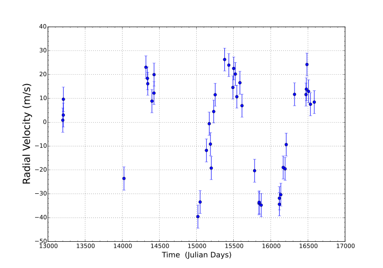
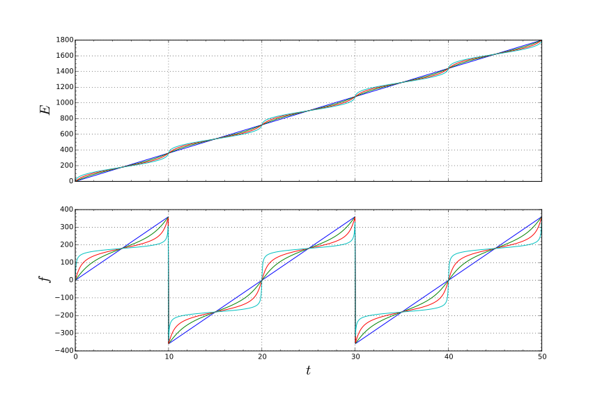

# Finding Planets with Star Wobbles

## Introduction

The last 5-10 years has seen the number of known planets grow to almost two thousand (with almost four thousand waiting to be confirmed). This burst in discovery is due mostly to the *Kepler* telescope. *Kepler* stared at roughly 200,000 stars for five years looking for a dip in the light they emit. Planets __transiting__ between us and their host star is one of the easiest and fruitful planet detection methods. However, the *first* exoplanet was discovered in 1995 by a completely different method; one that looks for the slight wobble of a star due to an orbiting planet. The __radial velocity__ method has since been a consistent method for finding new planets, and confirming candidate planets detected by other methods.

In keeping with our theme of using Python to explore and analyze data, we will be working with __real__ radial velocity data to find exoplanets with just a few built in Python functions.

## The Radial Velocity method

The radial velocity method works on the principle that a star + planet system will orbit about its common center of mass. The figure below depicts this.

The speed at which the star moves and its displacement from the center are set by the planet's mass and how close it approaches the star. What radial velocity measures is the velocity of the star in the direction towards us or away from us. To make this measurement, astronomers take a spectrum of the star. If the star is moving towards us, the spectral lines will be *blueshifted*, whereas if the star is moving away form us, the lines will be *redshifted*. This shift is directly related to the speed of the star along the line of sight. From the depiction above, it's clear that if the system is orientated face-on (as in the right), there will be no observed motion along the line of sight. On the other hand, if we're viewing the system edge-on, then the radial velocity signal will be the largest. This tilt of the star-planet system on the sky is called __inclination__, and it is very difficult to measure. If we don't know the inclination of the system, then we can only get a *lower* bound on the planet's mass.

Radial velocity data might look something like this,

  

Here we're plotting the observed radial velocity in meters per second on the vertical axis versus time in days. We can see that the observations for this star occurred over several years. We can see by eye that the data follow roughly a sinusoidal pattern (especially for the last half). The goal, then, is going to be to fit this data to a general sine (or cosine) curve,
$V_r(t) = amplitude cos(frequency t + phase) + offset$
Once we have the best fit period, amplitude, phase, and offset of the data, we can relate them to the physical properties of the planet and its orbit.

From the analytic solution of the gravitational two-body problem we can write the velocity of the star along the line of sight as,

$ V_r(t) = K ( cos( f(t) + w) + e cos(w))$

The time parameter here is hidden in the $f(t)$ angle (also called the [true anomaly][1]). If we connect this equation back to the equation for the general cosine wave, we see that the $K$ parameter is related to the amplitude, $f(t)$ is related to time and the period, $w$ is related to the phase, and $e$ (the eccentricity of the orbit) is related to the offset. The semi-amplitude, $K$, can be approximated as,

$K$ = 28.4 m s^{-1}  M_p sin i  P^{-1/3} M_star^(-2/3) (1 - e^2)^(-1/2)$

This says that maximum speed of the Sun if Jupiter where placed in the Earth's orbit would be about 28 m/s. Astronomers can detect these speeds down to ~ 1 m/s (that's walking speed!). We see that the strength of the radial velocity signal depends on the planet mass, the eccentricity, the orbital period, and the mass of the star. The true anomaly, $f(t)$ is related to time via the following two equaions,

$E - e sin(E) = n(t-tau)$

$tan(f/2) = sqrt((1+e)/(1-e)) tan(E/2)$

Here, $E$ is the [eccentric anomaly][2], $n(t-tau)$ is the [mean anomaly][3], and $n=2pi/P$ is the mean motion of the planet. Given a time, $t$, we first have to solve the first equation for the eccentric anomaly, $E$. This has to be done numerically. In Python we can use the handy [fsolve][4] function to do this easily. Once we have the eccentric anomaly, we can plug it into the second equation to calculate the true anomaly, $f$. The relationship between $f$ and $t$ is shown below for different eccentricities. The straight segments are for a circular orbit, while the most distorted curves are for an eccentricity of 0.9.  

Now that we've laid out our fitting procedure and connected our fitting parameters to our physical parameters, we can get into the coding.

## The Python

Given the radial velocity data, Python makes it simple to define a fitting function and then fit the data to that function. We've explored this in one of the [previous activities][5]. There we were fitting linear and quadratic functions with one or two parameters. Here, however, we will be fitting *five* parameters, $K, e, w, tau, n$, to our radial velocity data. We will again be making use of Python's [curve_fit][6] function to find the best parameters that describe our data.

Download the two python files [rv.py][7] and [rv_fit.py][8]. __Make sure to download them into the same folder__. The first file contains helper functions that solve the orbital equations described above and functions to visualize the data and fit to the data. The second file contains the fitting function and the function to load the data. The second file is missing some code, denoted by FIX MEs.  

Download the two data files for the stars [HD 10442][9] and [HD 5319][10]. __Make sure to save these to the same folder as the Python files__. Once the data files are downloaded, fill in the missing code in rv_fit.py and find the exoplanets!

## Results

If you coded everything up correctly, you should see plots that look something like these,

Now that you have measured masses, eccentricities, and periods for these planets, you can compare your results to the [accepted values][11]. Note that we can get pretty close given our simple fitting procedure. In reality, astronomers use more sophisticated and custom methods in order to explore all of the uncertainties in the measurements and the models. Nevertheless, this method can prove to be a useful first attempt at discovering planets! 

[1]: https://en.wikipedia.org/wiki/True_anomaly
[2]: https://en.wikipedia.org/wiki/Eccentric_anomaly
[3]: https://en.wikipedia.org/wiki/Mean_anomaly
[4]: http://docs.scipy.org/doc/scipy-0.16.0/reference/generated/scipy.optimize.fsolve.html
[5]: ../python/dark_energy/dark_energy.html
[6]:http://docs.scipy.org/doc/scipy-0.15.1/reference/generated/scipy.optimize.curve_fit.html
[7]: rv.py
[8]: rv_fit.py
[9]: hd10442.dat
[10]: hd5319.dat
[11]: http://www.openexoplanetcatalogue.com
